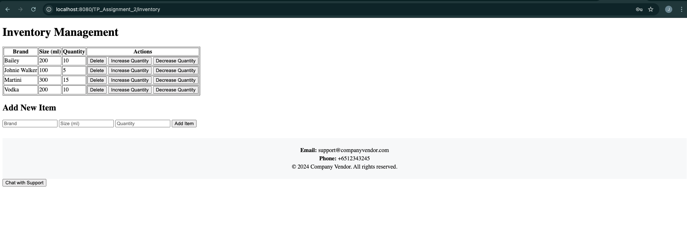

# Inventory Management System

This web application is an inventory management system built with Java, JSP, and MySQL.

## Features
- Login page with authentication
- Inventory listing with options to add, delete, and update quantities
- Chatbot feature for customer support
- Basic error handling and validation

## Screenshots

### Login Page
[Login Page](./screenshots/login.png)

### Inventory Management Page


## Setup

1. Clone this repository:
   ```bash
   git clone https://github.com/jaredtcy/codemanagement.git

   
2.  Set up a MySQL database with the following credentials:

- Database name: inventory
- Table: inventory
- Columns: brand, size, quantity

You can use this SQL query to create the table:

	CREATE DATABASE inventory;
	
	USE inventory;
	
	CREATE TABLE inventory (
	    brand VARCHAR(255),
	    size INT,
	    quantity INT
	);


3.   Configure the DB_URL, DB_USER, and DB_PASSWORD in InventoryServlet.java to match your local setup. For example:

	private static final String DB_URL = "jdbc:mysql://localhost:3306/inventory";
	private static final String DB_USER = "root";
	private static final String DB_PASSWORD = "password";

4.   Run the application on a Tomcat server or other servlet container:

	mvn clean install   # If you are using Maven for building the project
	# OR
	# Deploy the WAR file to your Tomcat server

Additional Information
- If you encounter any issues related to MySQL setup, make sure that your database is running and that your credentials match those in the InventoryServlet.java file.
- The application uses JSP (JavaServer Pages) for the front-end, so make sure your server is properly configured to handle JSP files.

